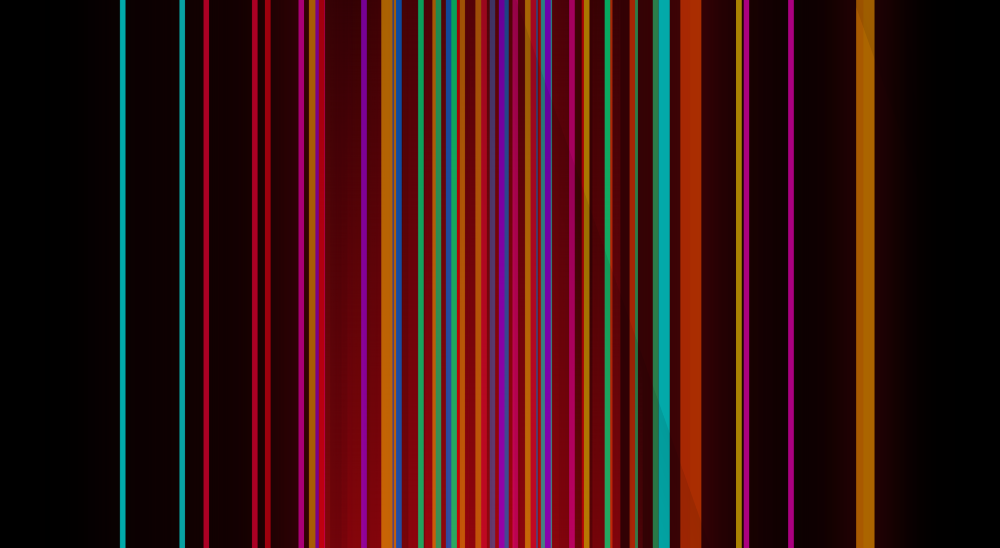

# Netflix-Intro-Clone

#### By Wendy Nina

## Table of Content

+ [Description](#description)
+ [Installation Requirement](#Installation)
+ [Technology Used](#technology-used)
+ [Reference](#reference)
+ [License](#license)
+ [Authors Info](#author-Info)

## Description
This is a clone of the netflix introduction animation. 

### Requirements
-Either a computer,phone,tablet or an Ipad

-Make sure you have access to internet

-Click on the live link in the about section

-Reload after animation ends to review.

[Go Back to the top](#Netflix-Intro-Clone)

### Installation Process
## Technology Used
HTML5- which was used to add the elements used.

CSS3 - which was used to for styling and adding the animation.

## Reference
(https://codepen.io/)

[Go Back to the top](#Netflix-Intro-Clone)

# License
Copyright (c) 2022 [click to view License](LICENSE)

## Authors Info
Linked In-[Wendy Nina]
(https://www.linkedin.com/in/wendy-nina-616559196/)

CodeWars-(https://www.codewars.com/users/the@rt_Coder)

[Go Back to the top](#Netflix-Intro-Clone)